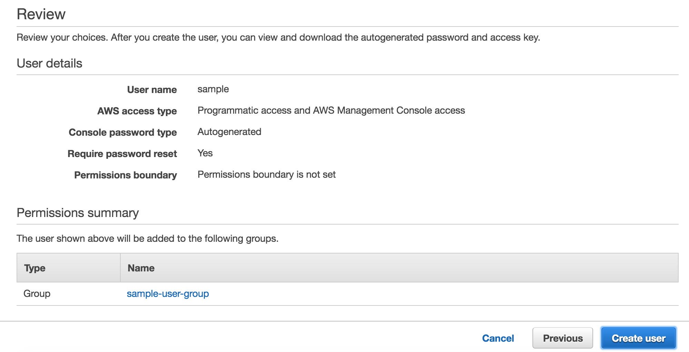
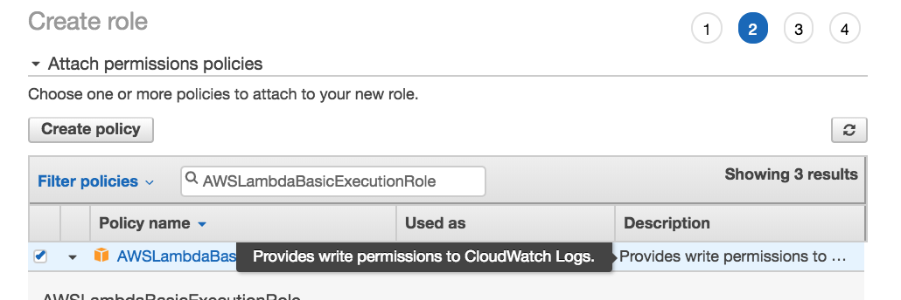

I spent the weekend trying out serverless on AWS. After dusting off my AWS Account and going to the lambda section and quickly setting up a sample function via the UI and running it I thought - sure let's do this!

* After 5 minutes I had a function running
* After 30 minutes I had hooked up Simple Email Service to trigger it
* After an hour I had my Code Commit and Code Build setup working.
* Enter the BRICK WALL. I could not get my artifact to deploy via Pipeline.

So after hours of frustration thinking "This should be easy, everything else just plugs together, why not this?!" I finally got it to work.
So here I will walk through the process I went through to set this system up. When finished you will have a private AWS Git repository that when pushed to, triggers an update to the deployed lambda function.

This article assumes you already have an AWS account. Everything here has fit easily into the free tier for me, so do not worry overly much about cost.

1.1) First we need to set up the repository; go to Code Commit in the AWS Console:


1.2) Select "Create Repository" and plug in whatever details you like:


2.1) Once you create it, if you are just an independent developer like myself with minimal AWS experience you may get an unhelpful warning because you logged in with your main AWS account. If you do not get this warning skip to 3):


2.2) Resolve this by creating a secondary account in the IAM console.


2.3) Go to the "Users" section and create a new user


2.4) IAM will ask you to put them in a group, go ahead and create a group; you do not have to attach any policies if you do not wish to.


2.5) On the next screen no need to add any tags either. This user will be totally empty until we add policies directly to them later. Proceed to create the user:


2.6) Copy the details on screen into your password manager or take note of them all somehow. After this step we will log in as this user, so at the very least take note of the login link, username, and password.:


2.7) Add policies to the user - minimal permissions are always superior, but if you want a quick answer just add the following policies. Log out, then log back in as the user.


2.8) Go to your Security Credentials.


2.9) Select the "AWS CodeCommit credentials" Tab and either upload an SSH key or add HTTPS credentials. You will use these to push your code to AWS via Git.

3.0) Return to CodeCommit and grab the Clone URL. You can set up a local place for your code to reside at this point, just set the remote `origin` to be the clone url.


3.1) At this point I was using Node.js. We will revisit the files in the repository later, when we are ready to push and build/deploy our code.

4.0) The next step is to set up CodeBuild so that it builds our code whenever we push to a specific branch. First we will set up a CodeBuild Project and then next tie them together using CodePipeline.

4.1) Go to CodeBuild and create a Project:


4.2) The page to configure the project is long, but probably intuitive for you. Things to be sure to do:
* Enter Project Name
* Configure Source to use the CodeCommit repository we created in step 1
* In the Environment section set up whatever environment you need. But leave "New Service Role" selected, and give it a name.
* Leave the rest of the configuration as default. Buildspec should be "use a buildspec file" and we do no need any artifacts; the buildspec file will define them.

4.3) Go to the new CodeDeploy role in IAM, add a policy that allows Read/Write to S3 so that the buildspec in 6) can push to the S3 bucket created in step 5)


5) Create an S3 bucket with default settings to upload the sam package too. In the buildspec below it is called "test99-build-artifacts"

6) Now that we have Source and a Build, lets create the buildspec inside our CodeCommit repository:

buildspec.yaml
```
version: 0.2 
 
run-as: root 
 
phases: 
  build: 
    run-as: root 
    commands: # sam.sometestapp.yaml will instruct CloudFormation how to deploy this code
      - npm i 
      # test99-build-artifacts is an S3 bucket created in step 5, use a different name
      # since all S3 buckets are unique
      - aws cloudformation package --template-file sam.template.yml --s3-bucket test99-build-artifacts --output-template-file sam.sometestapp.yaml --force-upload 
artifacts: 
  files: 
    - sam.sometestapp.yaml 
  name: sometestapp
  discard-paths: yes # this allows code pipeline to access same.sometestapp.yaml easily
```

7) To setup that sam.template.yaml for CloudFormation we need a role for our Lambda to run as. Go to IAM and create a service role with the AWSLambdaBasicExecutionRole policy. If you later notice CloudWatch logs are not behaving try expanding this role's permissions. You do not need any tags.





7.1) Grab the ARN for the role we just created.

8) Plug the ARN into the sam template within the repository. Create the index.js if it has not been created

sam.template.yml
```
AWSTemplateFormatVersion: '2010-09-09' 
Transform: AWS::Serverless-2016-10-31 
 
Resources: 
  sometestlambda: 
    Type: 'AWS::Serverless::Function' 
    Properties: 
      FunctionName: sometestlambda 
      Handler: index.handler # tells lambda to run module.exports.handler in index.js
      Runtime: nodejs8.10
      Description: 'Test Lambda'
      MemorySize: 128 
      Timeout: 30
      # this refers to the local directory when the template is packaged, 
      # the code in the local dir is zipped up and put in S3. The output sam file
      # has a uri that points to it
      CodeUri: ./ 
      Role: >- 
        role-arn-goes-here # the ARN for the role from step 6
```

index.js
```
module.exports.handler = (event) => {
  console.log('Success')
  return {
    status: 200
  }
}
```

8) Create a cloudformation role in IAM with the ExecuteLambda policy.

9) Follow the prompts to create a CodePipeline to build the code from master branch on push and deploy it to CloudFormation by Create/Updating a stack. Set the template to `BuildArtifact::sam.sometestapp.yaml` and add the CAPABILITY_AUTO_EXPAND capability to cloudformation's step so it can expand IAM access as it needs.

10) Save & Run your pipeline. Now every time you push it should build and deploy to lambda
